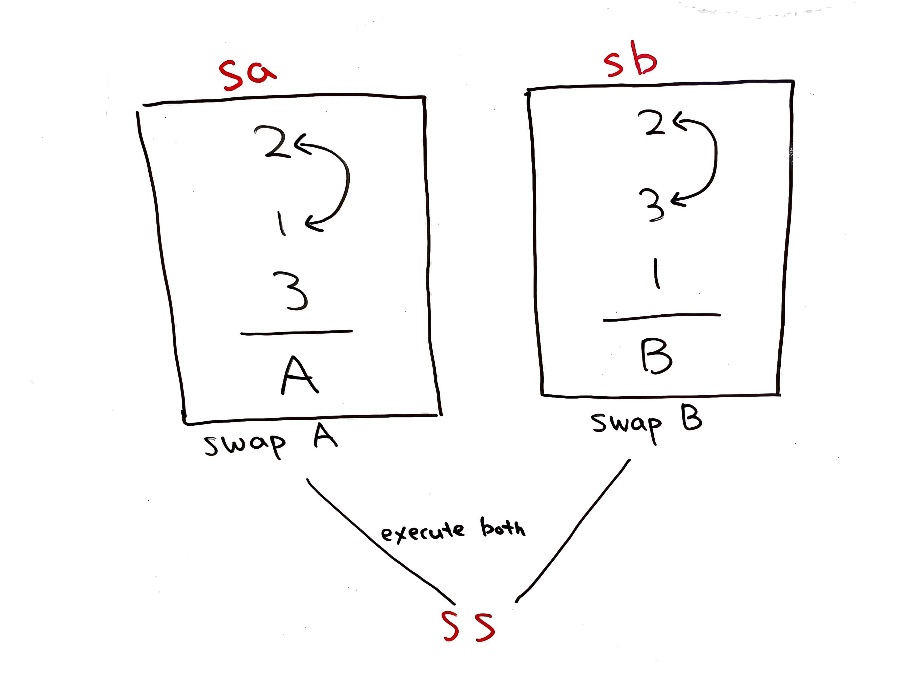
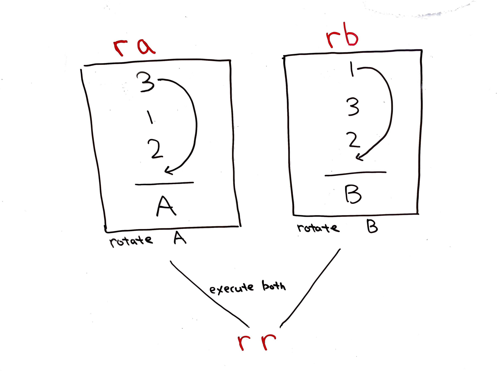
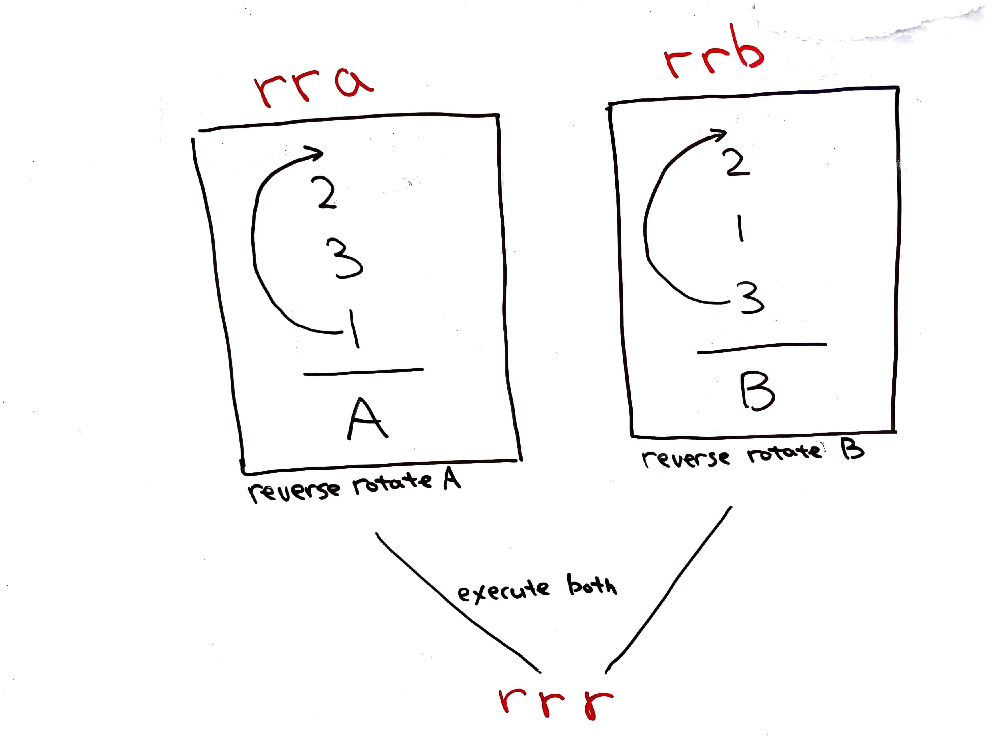
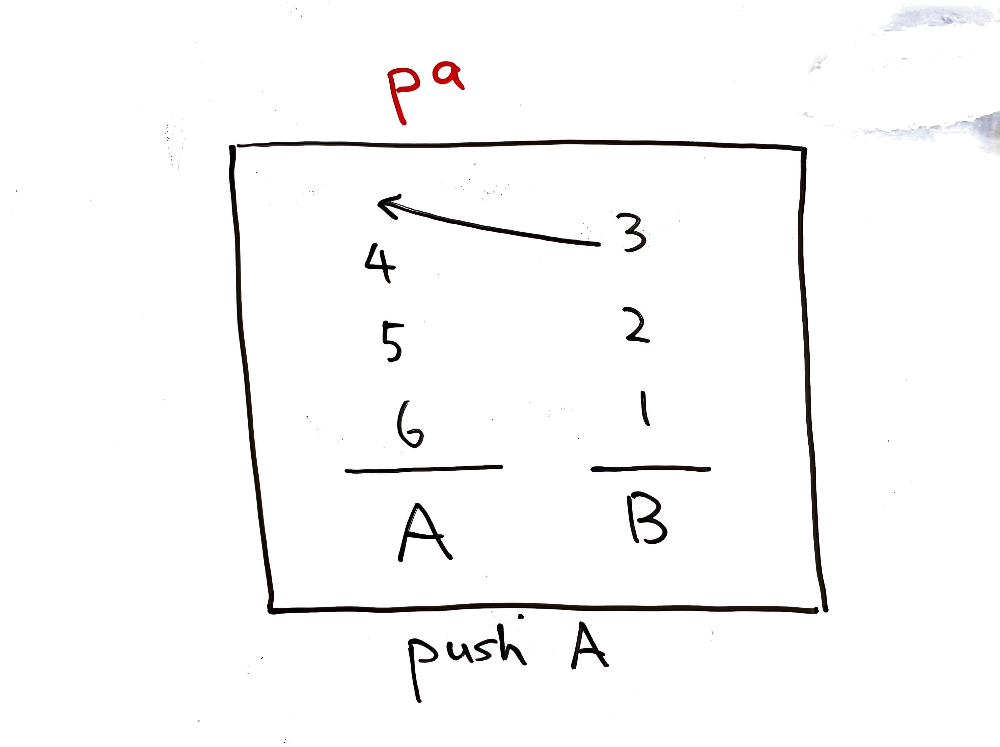
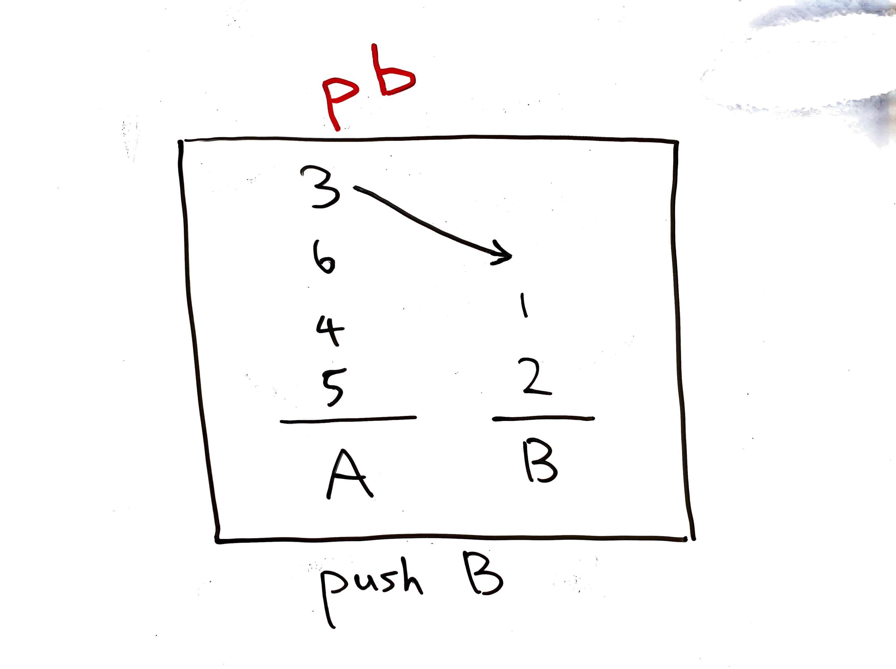
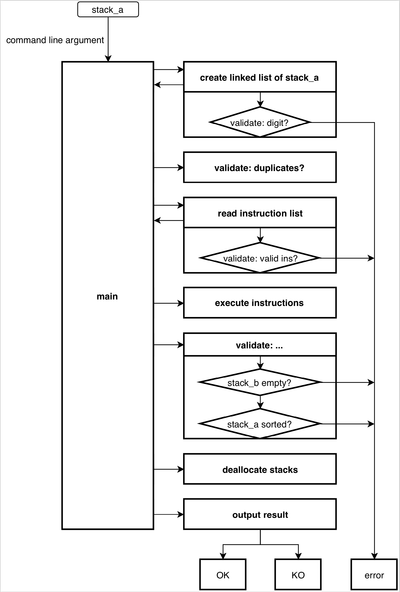
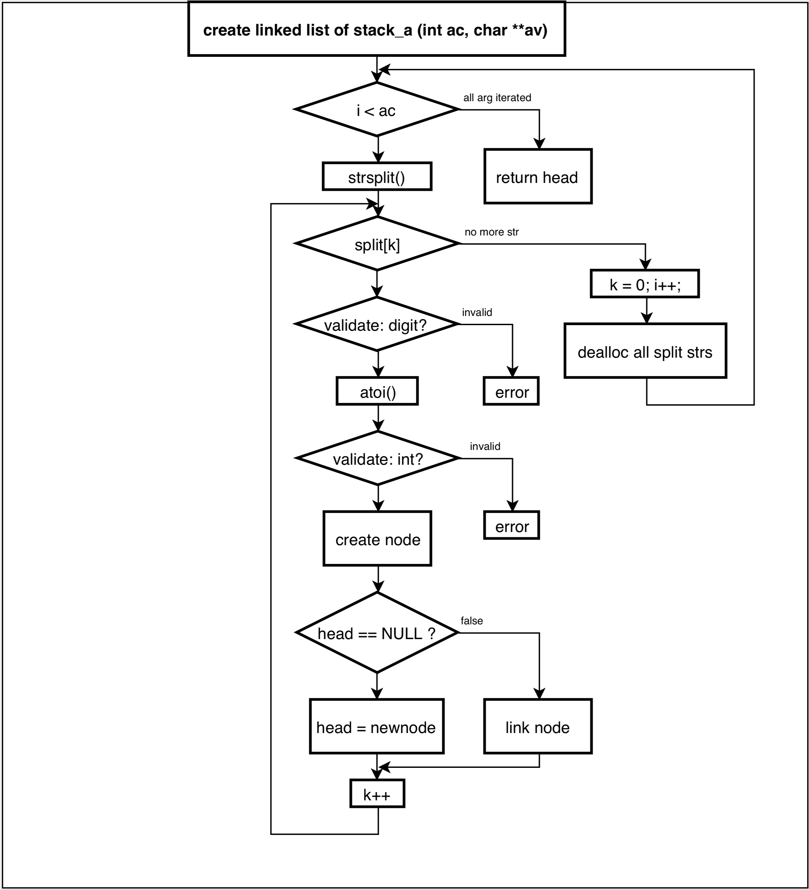
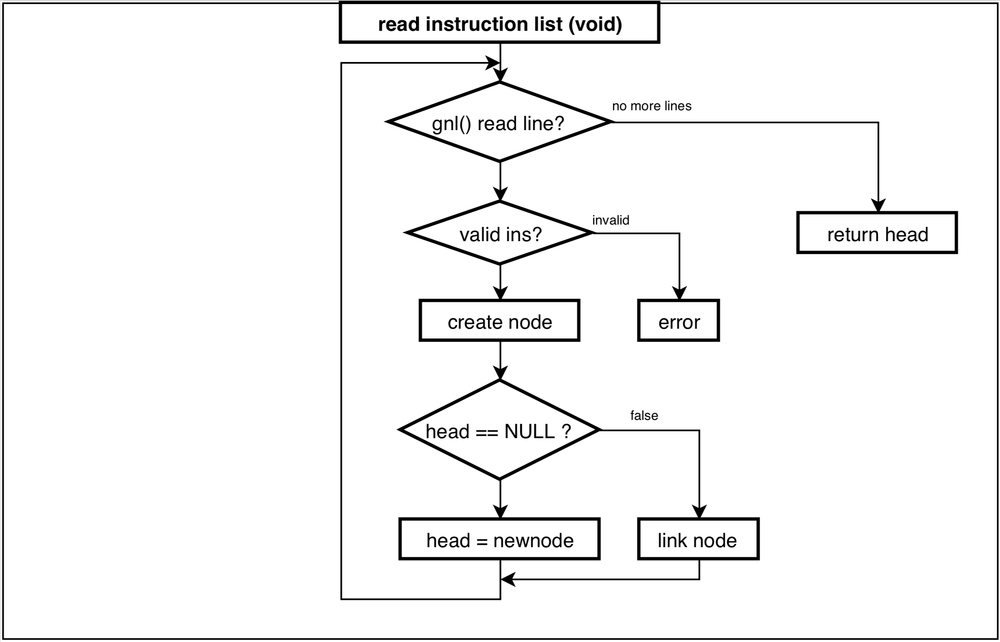
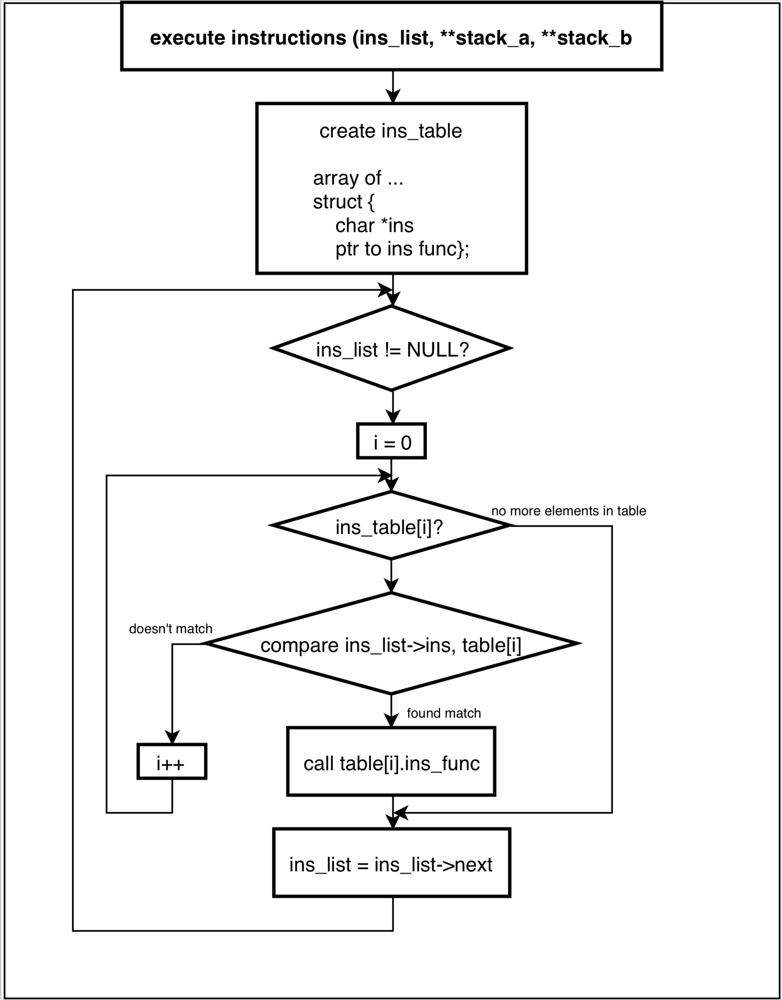

# What is `push_swap`?

_Below is a visualization of the process of my `push_swap` sorting 500 numbers._


### It's a data sorting game

- A data sorting game with restrictions intended to make the game more algorithmically challenging
- You must sort data:
    - using only 2 stacks
    - with the least amount of operations as possible
    - as fast as possible

### Objectives of the game

- Learn how to manipulate data on stacks
- Understand complexity
- Learn how to choose, tune, and utilize the appropriate data structures and sorting algorithms for given circumstances
- Learn how to optimize sorting algorithms for performance and efficiency
- Learn how to effectively test and debug

# Game rules

### General rules

- Write in C
- Use of C Standard Library is forbidden. Use your self-written-library if necessary.
- Only allowed to use the following functions across the entire project.
    - open
    - close
    - read
    - write
    - malloc
    - free
    - exit
- Can have any memory leaks
- Global variables are forbidden

### I**nput data**

This is the data that I'm suppose to sort.
It is a list of random integers (either positive or negative) without any duplicates.
This data must be initially loaded to Stack A.

### At my disposal

- Two stacks called **Stack A** and **Stack B**

    ```
     n    n
     n    n
     n    n
    ---  --- 
     A    B
    ```

- **Instruction set** (`sa`, `sb`, `ss`, `ra`, `rb`, `rr`, `rra`, `rrb`, `rrr`, `pa`, `pb`) to manipulate the contents of the two stacks

    

    

    

    

    

### Goal

- Load the input data into Stack A, then sort the contents of Stack A in ascending order.
- Stack B must be empty when the sorting completes.

### The `push_swap` program

The `push_swap` program must calculate and display a list of instructions to the standard output that will successfully sort the contents of Stack A in ascending order, with the least number of operations as possible, and preferably, as fast as possible.

```
$>./push_swap 2 1 3 6 5 8
sa
pb
pb
pb
sa
pa
pa
pa
```

### Maximum tolerated number of instructions

`push_swap` must generate a list of instructions that's smaller than the maximum tolerated number of instructions stated below.

**When sorting 3 numbers:**

- 3 instructions

**When sorting 5 numbers:**

- 12 instructions

**When sorting 100 numbers:**

- Less than 700 instructions: 5 points
- Less than 900 instructions: 4 points
- Less than 1100 instructions: 3 points
- Less than 1300 instructions: 2 points
- Less than 1500 instructions: 1 point
- More than or equal to 1500 instructions: fail

**When sorting 500 numbers:**

- Less than 5500 instructions: 5 points
- Less than 7000 instructions: 4 points
- Less than 8500 instructions: 3 points
- Less than 10000 instructions: 2 points
- Less than 11500 instructions: 1 point

### The `checker` program

The `checker` program must

- Take the input data as an argument, load them into Stack A
- Read the list of instructions generated by `push_swap` (from the standard input)
- Execute the instruction list on Stack A to validate the instruction list
- Give feedback to the standard output
    - `OK\n`
    Stack A has been successfully sorted with the given instruction list, and stack_b is empty.
    - `KO\n`
    Stack A could not be sorted with the given instruction list, and/or stack_b is not empty.
    - `Error\n`
    An error occurred during the validation process.
    errors include for example:
        - Some arguments are not integers
        - Some arguments are bigger than an integer
        - Duplicates were found in argument
        - An instruction don’t exist and/or is incorrectly formatted.

# How I solved the game

## `checker`

### Process flow



### Function design

**Create a linked list of stack_a**



### Read instruction list



### Execute instructions



## `push_swap`

### Data structure

Stack A, B, and the instruction list is managed as doubly linked lists.

```c
typedef struct    s_elm
{
  int             n;       /* number */
  int             seg;     /* assign segment id for manipulation purposes */
  t_bool          sorted;  /* is this number already sorted? */
  struct s_elm    *prev;
  struct s_elm    *next;
}                 t_elm    /* node of linked list */

typedef struct    s_stack
{
  t_elm           *head;
  t_elm           *tail;
  int             size;
}                 t_stack; /* stack */

typedef struct    s_ps
{
  t_stack         *a;      /* Stack A */
  t_stack         *b;      /* Stack B */
  t_stack         *ops;    /* instruction list */
}                 t_ps;    /* collection of pointers to all linked lists */
```

### Key algorithms

**Here are the pseudocode of my implementation.**

I created dedicated functions for the following cases.

- 3 numbers given as input data
- 5 numbers given as input data

```
int  main(int ac, char **av)
{
  error handling;
  variable definition;
  stacks = initialize_stacks(av + 1);

  if (sort_stack_a_only_using_rotation_if_possible(stacks) == FALSE)
  {
    if (stack_a->size == 3)
      sort_3(stack_a);
    else if (stack_a->size == 5)
      sort_5(stacks);
    else
      sort(stacks);
  }
  print_instruction_list(stack_instruction);
  memory deallocation;
}
```

`sort()` will handle all other cases, and it is the key function for this project.

```
void  sort(pointer_to_struct_containing_all_pointers_to_all_stacks)
{
  variable definition;
  memory allocation;
  error handling;

  while (1)
  {
    while (n_unsorted_numbers_in_stack_a > 3)
    {
      pb_numbers_less_than_or_equal_to_median(create_list_of_numbers_to_pb());
    }
    sort_remaining_unsorted_numbers_in_stack_a();
    if (n_numbers_in_stack_b > 0)
      pa_numbers_greater_than_or_equal_to_median();	
    else
      break ;
  }
  memory deallocation;
}
```
